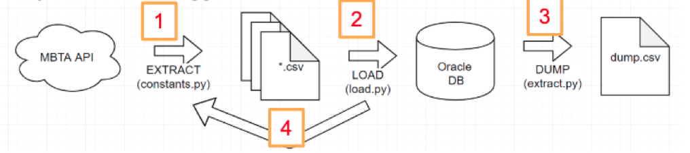
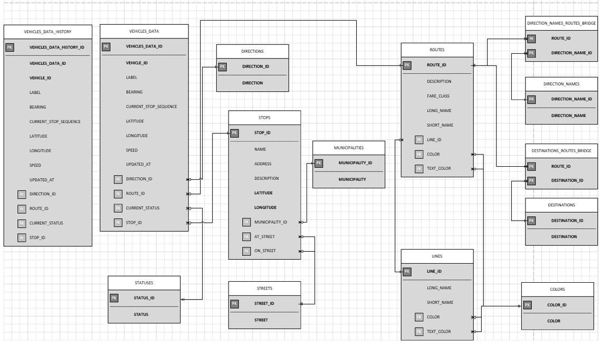
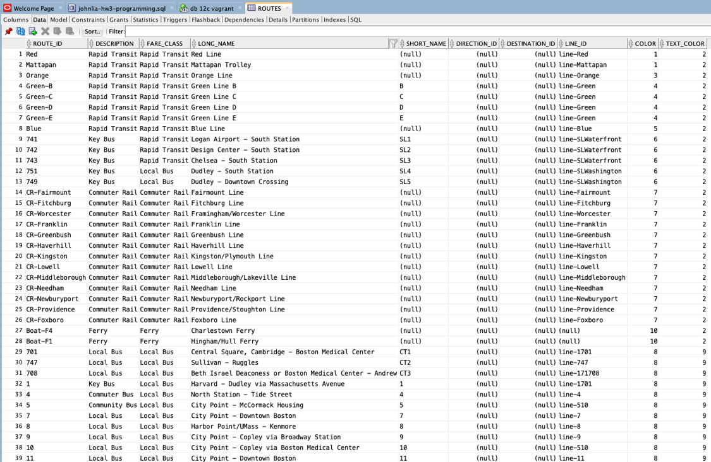

# Implementation of an MBTA ETL with an Oracle Database
John Liao  
CS 779 - Summer II 2019   
Final Project Term Paper

The following is my final project report for Boston University Metropolitan College for CS 779 (Advanced Database Systems).

The video presentation the project can be viewed [here](./files/cs779-presentation-johnliao.mp4) and the ppt can be downloaded [here](./files/cs779-presentation-johnliao.pptx).

## Executive Summary
This report documents implementation of an MBTA (Massachusetts Bay Transit Authority) API ETL into an Oracle database. This project focuses on a soup-to-nuts implementation to get a full breadth of understanding and application of database concepts learned during the semester in CS779.

There were many lessons learned when designing and implementing an ETL, including but not limited to (1) escaping special characters, (2) data type mismatches when ingesting data, (3) understanding on the ingest data on the fly.

The project was successfully completed with data to be successfully extracted from the API, transformed and loaded into a normalized database design and dumped to a csv format that can be uploaded to data aggregator sites like Kaggle.

## Concept Development


The MBTA API provides a wealth of live information, but does not necessarily provide historical data. This type of information could be potentially very useful for big data, understanding MBTA trends for other 3rd party developers, or be impactful for government decisions and legislation. This project attempts to store this wealth of data by ingesting it on a regular basis using the API’s generous limits and ease to get an API key. This project attempts to be an open source project that is not only academic learning, but also useful for other developers and data analysts. The data stored in the database will focus on vehicles and their temporal and position data, since that will change over time.

The workflow of the ETL is as follows:
1.  Python was used to fetch and extract the data and store them as CSV files from the API endpoints
2.  Python used with oracle python library (cx_Oracle) to load and normalize the data into oracle database
3.  Data can be dumped from the database into a csv file
4.  The extract and load process and be run repeatedly to collect more and more data



# MBTA API
Figure 2. MBTA Vehicles and Stops Examples

The MBTA provides a rich restful API that is easily accessible using an open specification, GTFS, known as General Transit Feed Specification. The API returns responses in JSON format. Although there are a number of API endpoints that may be used, only 4 were used for this project:

- https://api-v3.mbta.com/routes
- https://api-v3.mbta.com/stops
- https://api-v3.mbta.com/lines
- https://api-v3.mbta.com/vehicles

It should be noted that an API key is not required to access internal data from these endpoints. One can simply click on the above URLs and information is readily available.

During the extract process from the API, Python is used to parse relevant JSON information and store the data as CSV files for later use. The data could be stored in memory and directly pushed to the database, but was not explored. There was no specific library used to ingest the data _directly_ from JSON, rather, data was handpicked and pushed.

Here is a sample response from the **vehicles** endpoint:

```
data":[
   {
      "attributes":{
         "bearing":315,
         "current_status":"STOPPED_AT",
         "current_stop_sequence":180,
         "direction_id":0,
         "label":"3868-3697",
         "latitude":42.351200103759766,
         "longitude":-71.1163330078125,
         "speed":null,
         "updated_at":"2019-08-15T12:03:51-04:00"
      },
      "id":"G-10131",
      "relationships":{
         "route":{
            "data":{
               "id":"Green-B",
               "type":"route"
            }
         },
         "stop":{
            "data":{
               "id":"70141",
               "type":"stop"
            }
         },

      },
      "type":"vehicle"
   },
   . . .
```

Here is a sample response from the **routes** endpoint:
```
"data":[
   {
      "attributes":{
         "color":"DA291C",
         "description":"Rapid Transit",
         "direction_destinations":[
            "Ashmont/Braintree",
            "Alewife"
         ],
         "direction_names":[
            "South",
            "North"
         ],
         "fare_class":"Rapid Transit",
         "long_name":"Red Line",
         "short_name":"",
         "sort_order":10010,
         "text_color":"FFFFFF",
         "type":1
      },
      "id":"Red",
      "links":{
         "self":"/routes/Red"
      },
      "relationships":{
         "line":{
            "data":{
               "id":"line-Red",
               "type":"line"
            }
         },

      },
      "type":"route"
   },
   ...
   ```

As shown, the responses are in JSON format. Data that was felt to be important are highlighted and yellow and correspondingly have been stored in the database. It should be noted that some of the response data is multi-valued. Storing this as-is could be used but would not satisfy 2 normal form. In subsequent database design, these fields have handled by using bridge tables to resolve the potential many-to-many relationships.

# Database Design

## ERD Diagram

The following ERD diagram was built to be able to ingest all pertinent data with proper references. The design followed the idea of “normalize as much as possible and denormalize where it makes sense”. It was learned during the project that an ERD diagram is critical as a roadmap to create tables and relationships properly. Without it, it would have taken significantly longer to build out the tables and relationships.

As previously mentioned, there is a many to many relationship between routes and direction names (inbound/outbound) and destination routes (Alewife/Braintree). Bridge tables were implemented to resolve that potential issue.

One disadvantage is that in order to account for all potential combination possibilities, a cartesian product is created between routes and destination names including bus stops (Dudley Square, Watertown Station). This can create a huge number of combinations that do not exist, but could in the future. This could be further optimized if an actual specification was provided by the MBTA to show all possible combinations.



The following is an explanation of each table and relationships:

**VEHICLES_DATA_HISTORY**  
A copy of the vehicles data table with all the corresponding relationships. The arrows were not draw for clarity. When dumping, JOINS are performed to grab all pertinent data. A column for VEHICLES_DATA_ID is used to ensure no duplicate rows are entered. This table is maintained using triggers, indexes and stored procedures.
  
A simple trigger was implemented to ensure that no records can be deleted from the table. Indexes were added to foreign keys the ensure that lookup queries are performed faster. By default, B-Tree indexes are added by Oracle, so that was the type of index used. A stored procedure was implemented to bring over data from the VEHICLES_DATA table. The stored procedure synchronizes the tables together by checking what values exist in the VEHICLES_DATA table but do not yet exist in the VEHICLES_DATA_HISTORY table.

**VEHICLES_DATA**  
This table contains information for all MBTA transportation - trains, subways, and buses. Interesting attributes such as latitude, longitude, speed are tracked and keyed in. When loading and reading data in, **vehicle_id** and **updated_at** are checked like a composite key to ensure that no duplicate data is added. In retrospect, these two columns could have been used as a composite key, but was not pursued. There are several other foreign keys referencing other tables such as direction, current status, stop id. The updated_at is a value provided from the MBTA API that reflects when the data had been last updated, not when the row was inserted into the table. Ideally, the constants.py script would be polling the API faster than the values are being updated in the database to ensure that no information is missed.

**STATUSES**  
Statuses are values including “in transit to”, “stopped at”, etc.

**DIRECTIONS**  
Directions are a 0 or 1, referencing whether it is going inbound or outbound.

**STOPS**  
Stops include values that are train stations or bus stops. Interesting attributes include latitude, longitude, name, etc. The stops table references streets and municipalities.

**STREETS**  
Streets are simply street names like “Boston Avenue”.

**MUNICIPALITIES**  
Municipalities values include values like “Boston” or “Allston”.

**ROUTES**  
Routes table has routes that vehicles will take including information on their destinations and directions. There are other foreign keys that reference specific (train) lines a route will take and destinations and directions.

**LINES**  
Lines contains train lines, e.g. Red Line, Orange Line, etc.

**COLORS**  
Colors contain hex code for the actual color of the trains.

**DIRECTION_NAMES_ROUTES_BRIDGE_TABLE**  
This is a bridge table between the DIRECTION_NAMES and ROUTES tables.

**DIRECTION_NAMES**  
Direction names include values like “North”, “South”.

**DESTINATIONS_ROUTES_BRIDGE**  
This is a bridge table between DESTINATIONS and ROUTES tables.

**DESTINATIONS**  
Destinations include values like “Braintree”, “Alewife”, “Dudley Square”, “Watertown Square”.

## Triggers
The following code is for a trigger that prevents rows from being deleted in the VEHICLES_DATA_HISTORY table.

```
CREATE OR REPLACE TRIGGER VEHICLES_HISTORY
BEFORE DELETE ON VEHICLES_DATA_HISTORY
BEGIN
    raise_application_error(-20001,'Vehicle History records can not be deleted');
END;
```

## Indexes
The following index was added to the VEHICLES_DATA_HISTORY table to speed up queries.

```
CREATE INDEX i_route_id ON VEHICLES_DATA_HISTORY(route_id);
CREATE INDEX i_stop_id ON VEHICLES_DATA_HISTORY(stop_id);
```

## Stored Procedure
The following stored procedure is used to synchronize the VEHICLES_DATA and the VEHICLES_DATA_HISTORY table. It uses the VEHICLES_DATA_ID to ensure that duplicate rows are not copied over erroneously. This stored procedure can be run nightly or however frequently the history table needs to be kept up to date.

```
CREATE OR REPLACE Procedure DAILY_VEHICLES_DATA_BACKUP
IS    
BEGIN
    -- Select vehicle_data_ids from vehicles_data table that do not exist in vehicles_data_history table
    INSERT INTO VEHICLES_DATA_HISTORY (vehicle_data_id, vehicle_id, bearing, current_stop_sequence, 
    latitude, longitude, speed, updated_at, direction_id,
    route_id, label, current_status, stop_id) 
        SELECT vehicle_data_id, vehicle_id, bearing, current_stop_sequence, latitude, longitude, speed, updated_at, direction_id,
        route_id, label, current_status, stop_id FROM VEHICLES_DATA WHERE vehicle_data_id IN(
            SELECT vehicle_data_id from VEHICLES_DATA WHERE vehicle_data_id NOT IN (
                SELECT vehicle_data_id FROM VEHICLES_DATA_HISTORY));
END;
```

# Ingest Process
Python was the language of choice to extract, load, transform and dump the data. It turns out that normalizing and cleaning data is **not** easy at all. In an estimation of the total work to complete the project, it may have taken 50% to design the database and 50% of the time to ingest the data properly. In working with semi-structured data, there are many gotchas and edge cases that need to be taken into account to coerce the data and push them into the database.

For example, an interesting scenario came up when trying to ingest data on the fly. If one is ingesting data on the fly, then it’s quite possible that the proper table references are not in place to ingest it properly. For example, ingesting a STOP location with a STREET foreign key and that STREET has not been ingested in the STREET table.

There are a number of approaches, like ingesting non-conforming data to a temporary table to be handled later and ingesting data normally that have correct references. I took the hybrid approach. First, I ingested a single snapshot of data to initially populate tables with their references and constraints. Future ingested data will be compared against those constraints. If they do not fit, then they’re logged and handled later.

The following is the output of what happens when referential constraints are not met:

```
ROUTE_ID "2427" does not exist in ROUTES table - ignoring
ROUTE_ID "Shuttle005" does not exist in ROUTES table - ignoring
ROUTE_ID "Shuttle005" does not exist in ROUTES table - ignoring
ROUTE_ID "Shuttle005" does not exist in ROUTES table - ignoring
ROUTE_ID "441442" does not exist in ROUTES table - ignoring
ROUTE_ID "Shuttle005" does not exist in ROUTES table - ignoring
ROUTE_ID "Shuttle005" does not exist in ROUTES table - ignoring
ROUTE_ID "Shuttle005" does not exist in ROUTES table - ignoring
ROUTE_ID "Shuttle005" does not exist in ROUTES table - ignoring
ROUTE_ID "Shuttle005" does not exist in ROUTES table - ignoring
ROUTE_ID "214216" does not exist in ROUTES table - ignoring
ROUTE_ID "746" does not exist in ROUTES table - ignoring
ROUTE_ID "Shuttle005" does not exist in ROUTES table - ignoring
```

# Dump Process

As the VEHICLES_DATA_HISTORY table gets larger and larger with historical data, the information can be dumped out in the form of a CSV file using the extract.py script. Tables joins are performed to grab relevant information.

```
SELECT * FROM VEHICLES_DATA_HISTORY v 
        LEFT JOIN directions d ON d.direction_id=v.direction_id
        LEFT JOIN routes r ON r.route_id=v.route_id 
        LEFT JOIN statuses s ON s.status_id=v.current_status 
        LEFT JOIN stops st ON st.stop_id=v.stop_id
        LEFT JOIN municipalities m ON st.municipality_id=m.municipality_id
        LEFT JOIN streets str ON str.street_id=st.on_street 
        LEFT JOIN streets str ON str.street_id=st.at_street
        LEFT JOIN lines l ON l.line_id=r.line_id
        INNER JOIN colors c ON c.color_id=l.color 
        INNER JOIN colors c ON c.color_id=l.text_color 
        INNER JOIN colors c ON c.color_id=r.color 
        INNER JOIN colors c ON c.color_id=r.text_color
```

# Lessons Learned

## Data Normalization

In addition to satisfying current constraints, there is the question of normalizing the data itself. Single quotes are a special Oracle character and if it already existed in the data it needs to be cleaned and escaped (triple quotes).

## Data Types
Database data types are also a significant problem. When working with an API, and especially without explicit specifications on the types of API responses, databases are very finicky if it does not receive the expected datatype. As an example, if the API returned a value of “None” for a direction field, which had previously only expected NUMBER values like 0 or 1, Oracle would reject the entire INSERT statement.

## Edge Cases
Edge cases are also of concern.

For example, if one is trying to insert a row containing information on a train stop into the STOPS table that has an ON_STREET value but not an AT_STREET value, it may look something like this:
`INSERT INTO STOPS (STOP_ID, ON_STREET, ...) VALUES (...)`

While a stop that contains an AT_STREET but not an ON_STREET:
`INSERT INTO STOPS (STOP_ID, AT_STREET, ...) VALUES (...)`

While a stop that contains neither an AT_STREET nor an ON_STREET:
`INSERT INTO STOPS (STOP_ID, ...) VALUES (...)`

3 different INSERT statements are required to handle 3 cases. The code can quickly turn into a tangled mess when trying to account for each edge case. This makes it harder to maintain and harder to test.

## Idiosyncrasies of Language-Specific Embedded SQL Libraries

When working with an embedded SQL library, there are lessons learned how to use them properly. For example, how to instantiate a cursor, how to create a database connection object, how to commit, etc. This portion is unique to the language used, and took some time to figure out.

In this excerpt of load.py, a connection object is created to the database and a cursor is initiated.

```
# Create tns object
dsn_tns = cx_Oracle.makedsn('localhost', '1521', service_name='orclpdb1')

# Create connection object
conn = cx_Oracle.connect(user='system', password=password, dsn=dsn_tns)

# Initialize cursor
c = conn.cursor()
```

# Future
Here is a list of future enhancements that I think would be nice for the project. I did not have a chance to fully pursue these, but have noted them here.

1.  The dumped CSV data could be imported into Google Data Studio for better visualization
2.  The ETL could be run on a regular basis, versioned, and put online
3.  The data could be pushed to data aggregator sites like Kaggle
4.  Data warehouse tables could be used to analyze the large amount of data that can be collected
	1.  Stale vehicle updates (last_updated is stale)
	2.   Number of vehicles in transit
	3. How long each vehicle stays at each stop
	4. Geolocation analytics analyzing latitude, longitude attributes
	
# Screenshots

